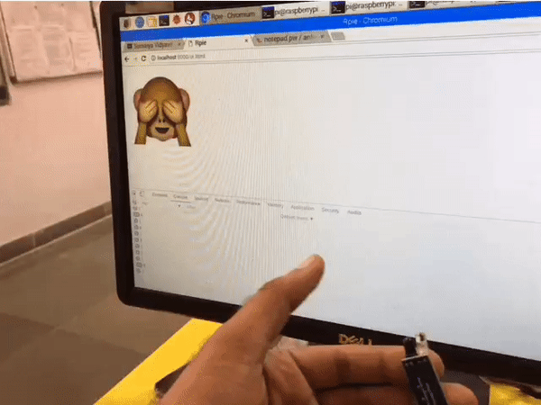

## Rpie WebInterface

* Purpose of this Experiment was to fetch data from Raspie's Sensors to Web Interface

### `server.py`

* `server.py` contains code for Raspie's IR sensor connectivity &  making the Data available on port `8794` continuously by websocket connection.
* websocket(`TCP`) connection is required for persistent connection between Web Interface and server for data recieved from IR sensor.

* for websocket follow [link](https://developer.mozilla.org/en-US/docs/Web/API/WebSockets_API/Writing_WebSocket_servers) how protocol works for handshake. 

### `ui.html`

* `ui.html` toggles the emoticon based on IR data recieved. 
> Check chrome's `console` and `network` tab for debugging

### Demo

</img>
